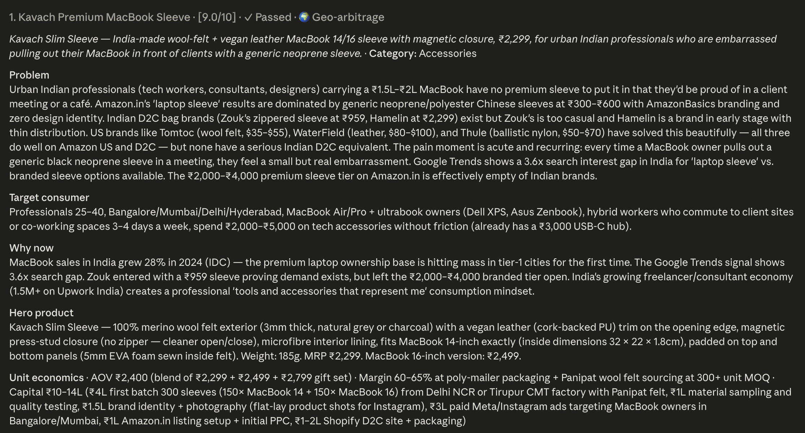

# D2C Idea Finder (Claude Code skill)

Find launchable D2C product ideas for the Indian market, tuned to your taste, capital, and category preferences. Runs as a Claude Code skill — install once, then ask Claude for ideas any time.

> **Heads up:** Expect rough edges. If something breaks, [file an issue](https://github.com/mailsajal97/india-d2c-ideas-agent/issues).

## What it does

Pulls signal from **Indian marketplaces** (Amazon.in, Flipkart, Nykaa, Myntra, Lenskart, FirstCry, Healthkart, BigBasket and ~12 other specialist sites), **quick commerce** (Blinkit, Zepto, Instamart, BBNow — for FMCG-relevant categories), **Reddit + Amazon US** (consumer pain mining), **rising US D2C publications** (Modern Retail, Retail Brew, The Fascination, Exploding Topics), and **Google Trends** (US-vs-India interest gaps). Runs an opinionated multi-agent pipeline (6 opportunity lenses, hard filters, multi-stage enrichment) and surfaces 5 ideas — sized to your capital ceiling, scoped to your categories, scored against the distribution channels you can actually execute on.

Profile-driven, not learning-driven. You tell it your categories, capital, channels, and excludes during onboarding (3 minutes). Tell it "drop pet" or "bump capital to 15L" in chat and it edits your profile via `update_profile.py`. No black-box learning loop — every adjustment is explicit and visible in `user_data/profile.yaml`.

## Install

```bash
mkdir -p ~/.claude/skills
git clone https://github.com/mailsajal97/india-d2c-ideas-agent ~/.claude/skills/india-d2c
```

`mkdir -p` creates `~/.claude/skills/` if this is your first user-level skill. Safe to run even if the folder already exists.

In any Claude Code chat:

```
find me some d2c ideas
```

Claude will detect that this is your first run and walk you through a ~3-minute setup, then run the pipeline.

## Requirements

- Python 3.10 or later (system Python is fine — the skill creates its own venv)
- An **Exa API key** — sign up at https://exa.ai. Exa is the search backbone of the entire pipeline (collectors, signal enrichment, idea generation, competitor mapping all use it). A typical run uses ~60-70 Exa queries, so the free tier of 1,000 requests/month covers roughly 14-16 runs.
- An **Anthropic API key** — get one at https://console.anthropic.com. The skill's Python scripts call Claude via the SDK from a separate process, so they need their own key. **Your Claude Pro / Max subscription does NOT cover this.** Per-run cost is roughly **$1-2** (scales with signal volume).

## Source coverage caveats

The skill uses Exa neural search across multiple sources. Most work well; two are weaker than the rest and worth knowing about.

- **Indian marketplaces (Amazon.in, Flipkart, Nykaa, Purplle, Myntra, Ajio, Nykaa Fashion, Lenskart, FirstCry, Hopscotch, Healthkart, 1mg, BigBasket, Pepperfry, Supertails, MyMuse, Tata-Cliq, Croma, Decathlon)** — work well. These have public product pages and reviews that Exa indexes thoroughly. Primary signal source for India-side demand and complaints.
- **Reddit + Amazon US** — work well. Mined for consumer pain language and arbitrage signals (what US consumers complain about that India will too).
- **US D2C publications (Modern Retail, Retail Brew, The Fascination, Exploding Topics)** — work well. Rotated each run from a pool of 12 query variants so we expand signal coverage over time.
- **Quick commerce (Blinkit, Zepto, Instamart, BBNow)** — works **adequately for FMCG-relevant categories only** (beauty, personal care, food, home basics, wellness). Returns real product listings but doesn't get real-time stock or true bestseller rankings — enough to confirm category activity, not enough for precise demand sizing.
- **Google Trends** — works **partially**. Google rate-limits pytrends aggressively (often 90%+ of queries get blocked in a single run). Treated as a secondary confirmation signal — geo-arbitrage signal still comes through the other 4 collectors.
- **Instagram** — used **only in competitor enrichment** (not signal collection), and **weakly** even there. Most IG content is login-gated, so Exa returns mostly indirect mentions (brands featured in articles, profile snippets) rather than real hashtag activity. Treat IG results in competitor data as suggestive, not authoritative. Planned for v2: native Apify Instagram Hashtag Scraper.

## How it works

The pipeline runs in six stages:

1. **Collection** — five collectors pull raw signals. Four use [Exa](https://exa.ai) neural search:
   - **`india_marketplaces`** — site-specific searches across 17+ Indian marketplaces (capped at 15 queries/run via round-robin across your picked categories). Mix of complaint-focused queries ("1-star", "did not work") and demand-focused queries ("bestseller", "top rated") with multiple template variants rotated per run.
   - **`exploration`** — 3 universal D2C queries (funding news, US arbitrage, quick-commerce trends) plus 2 templated category-specific Reddit/marketplace queries per picked category. Always reflects current profile, no cached query files.
   - **`rising_brands`** — 4 queries sampled from a pool of 12 variants across 4 US D2C publications (Modern Retail, Retail Brew, The Fascination, Exploding Topics). Date-seeded random sample, so the query mix rotates day-to-day.
   - **`amazon_us`** — 1 cross-platform Reddit + Amazon US query per picked category for arbitrage signal.

   The fifth (**`google_trends`**) uses pytrends to check US-vs-India interest gaps for ~60 D2C keywords (heavily rate-limited; treated as confirmation signal).

2. **Enrichment** — Claude Sonnet validates each signal, runs additional Exa searches to confirm pain severity and check whether an Indian equivalent already exists, then normalises them into a consistent schema.

3. **Idea generation** — Claude Sonnet produces 5 ideas from the enriched signal pool, biased by your taste profile (categories, capital, channels, excludes). Each idea is tagged with which of the 6 opportunity lenses it fires: `complaint_cluster`, `geo_arbitrage`, `format_shift`, `unbranded_market`, `rising_brand_gap`, `wildcard`. The prompt constrains diversity — at least 3 different lenses across the 5 ideas, no single lens used more than twice — so you don't get 5 variations of the same template.

4. **Competitor mapping** — for each generated idea, six Exa searches map the Indian competitive landscape across Amazon.in, Flipkart, specialist marketplaces (Nykaa/Purplle for beauty, Myntra/Ajio for fashion, 1mg for wellness, etc.), quick commerce (Blinkit, Zepto, Instamart, BBNow), Google India, and Instagram (caveat: IG results are weak — see "Source coverage caveats").

5. **Scoring + tagging** — Claude Haiku scores each idea on demand strength, India launchability, capital fit, competition density, distribution fit, and arbitrage confidence. Ideas that fail hard thresholds (launchability < 6, capital fit < 7, competition > 7) get **tagged as flagged with plain-language reasons** — they still surface in the output, just below the passing ones, so you can see what was rejected and why.

6. **Output** — ranked markdown lands in `user_data/latest_ideas.md`. Passing ideas sort first, then flagged ones with explanations.

The scoring is fully personalised. Your capital ceiling, picked categories, and distribution channel scores all flow into the evaluation prompt at runtime — ideas that need channels you don't have (e.g., quick commerce placement if you scored that 0) get penalised on `distribution_fit` and surface lower.

After the run, you can react in chat using plain English. If your reaction maps to a profile change, Claude applies it and asks if you want to re-run:

- *"skip pet forever"* → drops pet from your categories
- *"bump my capital to 15 lakh"* → raises your capital ceiling
- *"add fashion to my categories"* → adds fashion & apparel
- *"add quick commerce as a channel"* → adds quick commerce to your channels
- *"drop influencer marketing"* → removes that channel
- *"show me my settings"* → prints your current profile

Reactions that don't map to a profile change (*"I like #2"*, *"the wellness angle is interesting"*) get acknowledged in chat but don't change anything — Claude will ask if you want to translate them into a concrete profile edit.

**There is no black-box learning loop.** Every adjustment is explicit and visible in your profile.

## Example output

A typical run produces 5 ideas, ranked by composite score. Each idea has Problem, Target consumer, Why now, Hero product, Unit economics, Sourcing notes, GTM playbook, named Indian competitors, and global reference brands. Ideas that fail hard thresholds (launchability, capital fit, competition) get flagged with reasons but still appear.

Below is one idea from a real run, rendered in the Claude Code Mac app. Profile used: 3 picked categories (accessories, jewellery & watches, eyewear), capital ceiling ₹30 lakh, distribution channels: paid digital ads, organic social, influencer, PR/press, quick commerce, referral/virality.



<details>
<summary>See the raw markdown the skill produces</summary>

```
## 1. Kavach Premium MacBook Sleeve  ·  [9.0/10]  ·  ✓ Passed  ·  🌍 Geo-arbitrage
_India-made wool-felt + vegan leather MacBook 14/16 sleeve with magnetic closure,
₹2,299, for urban Indian professionals who are embarrassed pulling out their
MacBook in front of clients with a generic neoprene sleeve._  ·  **Category:** Accessories

**Problem**
Urban Indian professionals carrying a ₹1.5-2L MacBook have no premium sleeve to
put it in that they'd be proud of in a client meeting or a café. Amazon.in is
dominated by generic neoprene at ₹300-600 with AmazonBasics branding and zero
design identity. Indian D2C bag brands (Zouk's sleeve at ₹959, Hamelin at
₹2,299) exist but Zouk's is too casual and Hamelin has thin distribution.
US brands like Tomtoc, WaterField, and Thule have solved this beautifully but
none have a serious Indian D2C equivalent. The ₹2,000-4,000 premium sleeve
tier on Amazon.in is effectively empty of Indian brands.

**Target consumer**
Professionals 25-40 in Bangalore/Mumbai/Delhi/Hyderabad, MacBook Air/Pro +
ultrabook owners (Dell XPS, Asus Zenbook), hybrid workers commuting to client
sites or co-working spaces 3-4 days a week, spend ₹2,000-5,000 on tech
accessories without friction.

**Why now**
MacBook sales in India grew 28% in 2024 (IDC). Google Trends shows a 3.6x
search interest gap for "laptop sleeve" vs branded sleeve options available.
Zouk entered with a ₹959 sleeve proving demand exists but left the ₹2,000-4,000
branded tier open. India's growing freelancer/consultant economy creates a
"tools and accessories that represent me" consumption mindset.

**Hero product**
Kavach Slim Sleeve: 100% merino wool felt exterior (3mm thick, natural grey or
charcoal) with vegan leather (cork-backed PU) trim on the opening edge,
magnetic press-stud closure (no zipper, cleaner open/close), microfibre interior
lining, fits MacBook 14-inch exactly (inside 32 x 22 x 1.8cm), 5mm EVA foam
padding sewn inside felt. Weight: 185g. MRP ₹2,299. MacBook 16-inch: ₹2,499.

**Unit economics**  ·  AOV ₹2,400  ·  Margin 60-65%  ·  Capital ₹10-14L
(₹4L first batch 300 sleeves, ₹1L material sampling, ₹1.5L brand identity +
photography, ₹3L paid Meta/Instagram, ₹1L Amazon.in listing + PPC, ₹1-2L
D2C site)

**Sourcing**
Wool felt: Panipat or Bikaner mills (India is a major wool felt producer;
550gsm merino-blend at ₹280-380/m, each sleeve uses ~0.4m). Vegan leather:
Ahmedabad PU suppliers. CMT: Delhi NCR or Tirupur (₹180-220 per unit at 300+
MOQ). First batch ~₹3.5-4L material + CMT.

**Go-to-market**
1) Amazon.in primary marketplace: A-plus content with wool-felt close-up
photography drives conversion in a category dominated by generic Chinese
products. 2) Instagram paid ads targeting MacBook owners in Bangalore/Mumbai,
creative showing the sleeve on a café table next to a flat white. 3) Corporate
gifting outreach to tech companies (Razorpay, Zepto) for new-hire onboarding
kits. 4) Tech YouTuber + Instagram creator seeding for honest reviews.

**Wedge / why it wins**
vs Zouk sleeve (₹959, no material story, zipper aesthetic doesn't suit a client
meeting) and Hamelin Zeus (₹2,299, no MacBook size-specific SKU, limited
distribution) — Kavach wins on wool felt as a tactile identity material +
magnetic press-stud (silent, meeting-appropriate) + MacBook-exact sizing, all
at the same price as Hamelin but with stronger brand story.

**Indian competitors**
Dyazo Plus (generic neoprene, multiple pockets dilute focus), StrapIt
(jute/canvas, lacks premium positioning), AirCase (ballistic nylon ₹800-1200,
bulk-oriented), FEDUS ORO (polyester with handles, casual aesthetic), Banjara
Gear (leather at ₹12,500, niche), thin direct competition in ₹2-2.5k merino
wool segment.

**Reference brands (global)**
Tomtoc (China/US, wool felt MacBook sleeves, affordable premium), WaterField
Designs (US, vegetable-tanned leather cases, design-forward), Hard Graft
(Austria/UK, wool + leather hybrid, luxury positioning).

**Sub-scores**
- Demand:              ■■■■■■■□□□ 7/10
- Launchability:       ■■■■■■■■■□ 9/10
- Capital fit:         ■■■■■■■■■□ 9/10
- Competition headroom: ■■□□□□□□□□ 2/10
- Distribution fit:    ■■■■■■■■□□ 8/10
- Geo-arbitrage:       ■■■■■■■■□□ 8/10
```

</details>

The "Competition headroom: 2/10" surfaces honestly that this category is competitive. The system doesn't hide that just because the overall score is high. Flagged ideas (when they appear) get a one-line "Why flagged" explanation and sort below passing ones, so you can see what was rejected and why.

## Cost

- **Exa**: free tier is 1,000 requests/month. A typical run uses ~60-70 Exa queries (15 india_marketplaces + 12 exploration + 4 rising_brands + 1-5 amazon_us + 30 competitor enrichment), so the free tier covers **~14-16 runs/month**. Next tier is $49/month for 10,000 requests (covers ~150 runs).
- **Anthropic API**: roughly **$1-2 per run** (cost scales with signal volume — Sonnet enrichment is the dominant line item, processed in batches of 20 signals each). Billed from your Anthropic Console workspace — NOT from your Claude Pro/Max subscription. A typical user running 2-3 times per week spends ~$10-25/month.
- **Google Trends**: free.

Realistic total: under $50/month even for power users. Most people stay on free tiers.

## File layout

```
india-d2c/
├── SKILL.md                  # the skill definition Claude reads
├── README.md                 # this file
├── requirements.txt          # Python dependencies
├── .env.example              # template for the .env file (no secrets)
├── .gitignore                # excludes .env, user_data/, venv/
├── scripts/
│   ├── setup.py              # first-time onboarding (writes user_data/)
│   ├── find_ideas.py         # main pipeline runner
│   ├── update_profile.py     # edits profile.yaml from chat-driven requests
│   ├── set_key.py            # adds/updates API keys in .env
│   ├── render_markdown.py    # formats ideas for the chat
│   ├── collectors/           # 5 signal collectors (Exa-based + Google Trends via pytrends)
│   ├── agents/               # 4 LLM agents (enrichment, idea, competitor, evaluation)
│   └── utils/                # SQLite, logger, Exa client, schemas, model IDs
├── venv/                     # auto-created by setup.py
└── user_data/                # gitignored — your profile, API key, state, history
    ├── profile.yaml          # your preferences (the only file you ever touch)
    ├── .env                  # your Exa + Anthropic API keys (chmod 600)
    ├── state.db              # SQLite for dedup and run history
    ├── latest_ideas.md       # most recent run's output (read by Claude in chat)
    ├── latest_ideas.json     # structured snapshot of the same ideas
    └── runs/                 # archive of every run, by timestamp
        ├── 2026-05-26_033212_ideas.md
        ├── 2026-05-26_033212_ideas.json
        └── ...               # ask Claude "show me past runs" to surface these
```

## Resetting

To start over with a fresh taste profile, delete `user_data/` and re-invoke the skill. Your next chat request triggers setup again.

```bash
rm -rf ~/.claude/skills/india-d2c/user_data
```

## Troubleshooting

**"No signals collected"** — Check your Exa key is valid (`cat ~/.claude/skills/india-d2c/user_data/.env`) and you have network connectivity. Exa rate-limits free-tier accounts; if you hit the monthly cap, the collectors return empty.

**"Idea generation failed"** — Usually means the Anthropic API key isn't reachable. If running inside Claude Code, this should never happen. If running standalone, set `ANTHROPIC_API_KEY` in your shell.

**"Google Trends returning 429"** — Expected, not a bug. Google rate-limits pytrends aggressively (often 90%+ of queries get blocked in a single run). The collector swallows the errors and the pipeline continues normally. Geo-arbitrage signal still comes through `rising_brands`, `exploration`, and `amazon_us` — see "Source coverage caveats" above. Google Trends is treated as a secondary confirmation signal, not a critical source.

**Pipeline takes a while** — Expect **12-18 minutes** per run depending on how many signals get collected. Signal enrichment and idea generation are the dominant stages and scale with signal volume. Competitor enrichment is parallelized (5 concurrent Exa searches max, to stay inside Exa's rate limit) so it's ~1-2 min instead of the 6 min it would be sequential. The status file at `user_data/progress.txt` always shows the latest stage if you want to peek mid-run. If a run fails mid-pipeline, the next run resumes from a checkpoint (24-hour TTL) and skips the slow signal-collection + enrichment stages.

## For contributors — design principles

If you're forking this skill or adding features, four principles worth following. These came out of real debugging during build:

### 1. User state lives in files, not in SKILL.md or memory

`user_data/profile.yaml` is the single source of truth for the user's capital ceiling, picked categories, distribution channels, and hard excludes. `user_data/.env` is the single source of truth for API keys. There is no derived/cached state — exploration queries, taste context, and idea generation all read profile.yaml fresh on every run.

Claude in chat should ALWAYS Read these files when it needs current state — never quote values from SKILL.md examples or from earlier conversation turns.

### 2. Examples in SKILL.md should look like placeholders, not data

A real failure mode we hit: SKILL.md had `"capital_ceiling_lakh": 20` as a JSON example. Claude later regressed to that value when summarising the user's settings, even though the user had entered 5. The user lost trust.

Fix: write examples with explicit placeholder syntax that Claude can't latch onto as a value:

```json
"capital_ceiling_lakh": <number from Q6 — use the user's exact answer>
```

Anywhere a real number could leak into output, use angle-bracket placeholders.

### 3. Force re-reads before citing user state

Behaviour rule in SKILL.md: when answering "what's my capital ceiling?" or making suggestions like "bump from X to Y", Claude must Read `user_data/profile.yaml` first. This is cheap, deterministic, and prevents the most common hallucination pattern.

Apply the same rule for any new feature that surfaces user state.

### 4. Stream long-running progress via stdout, not just logger

Logger output goes to stderr; the Monitor tool in Claude Code watches stdout. If you add a new agent or stage that does work for more than ~30 seconds, emit progress lines to BOTH stdout (4-space indented format) AND `user_data/progress.txt`. The existing pattern lives in `_emit_progress()` in `signal_enrichment_agent.py`, `idea_agent.py`, and `competitor_enrichment_agent.py` — copy that helper.

Without this, the user sees dead silence between stage transitions and starts wondering if the pipeline is stuck.

## What this skill is not

- **Not a SaaS product.** No hosted infra. You bring your own Exa + Anthropic keys. Everything runs locally.
- **Not US-focused.** Primary signal source is Indian marketplaces; ranking, filters, and competitor mapping are India-specific. The geo-arbitrage lens specifically uses **US** consumer pain (mined from Reddit + Amazon US + US D2C trade publications) to spot opportunities India hasn't filled yet. Ideas may *reference* Japanese, Korean, or European brand parallels in the output, but those come from the model's training knowledge — the skill doesn't actively scrape those geographies.
- **Not a general-purpose idea generator.** Strong opinions are baked in: you set your own capital ceiling during onboarding (recommended ₹10-20L based on D2C launch realities), AOV ≥ ₹800, gross margin ≥ 60%, hard excludes you can pick from (cold chain, complex formulation, tight regulation, items over 10kg, ingestibles).
- **Not a learning system.** No black-box adaptation. You change behaviour by saying what you want in chat ("add fashion to categories", "bump my capital to 15L", "drop pet") — every change is explicit, visible in your profile, and reversible.

## Credits

Built by [Sajal Agarwal](https://github.com/mailsajal97).

A multi-agent Claude Code skill that surfaces launchable Indian D2C product ideas — tuned to your capital ceiling, category preferences, and distribution channels.

## License

MIT.
